# Vision Analytics Solution Using Dataflow, Vision AI & BigQuery ML 

This repo contains a reference implementation  to gather  insights by inspecting image files stored in GCS. The goal is to provide an easy to use end to end automated solution by using Dataflow, Vision API and BigQueryML.  This is a generic solution to automate  large scale image processing and can be used for variety of use cases like below: 

1. Automated visual inspection solution for manufacturing industry. 
2. Automated stock and inventory inspection for retail industry.
3. Automated damage assessment for insurance industry 

Response from  Vision API  is stored in tabular format in BigQuery tables par feature. You can use this dataset as additional features to create ML model by using BigQuery ML or Auto ML. 

## Table of Contents  

* [Reference Architecture](#reference-architecture).      
* [Solution Details](#solution-details).      
* [Getting Started](#getting-start).  
	* [Build](#build).
	* [Flex Template](#flex-template)
* [Test & Validate ](#test-and-validate). 
	* [Automated BigQuery tables by feature type](#test-feature-types)
	* [Running Lable and Landmark detection  for Fickr30k dataset](#load-test)
* [Analysis ](#analysis). 
	* [Top label by file](#top-label-by-file) 
	* [Top 10 labels](#top-10-labels)  
	* [Top 10 popular landmark](#top-10-popular-landmark)
	* [Images with falls](#images-with-falls)
	* [Popular parks](#popular-parks)
	
# Reference Architecture

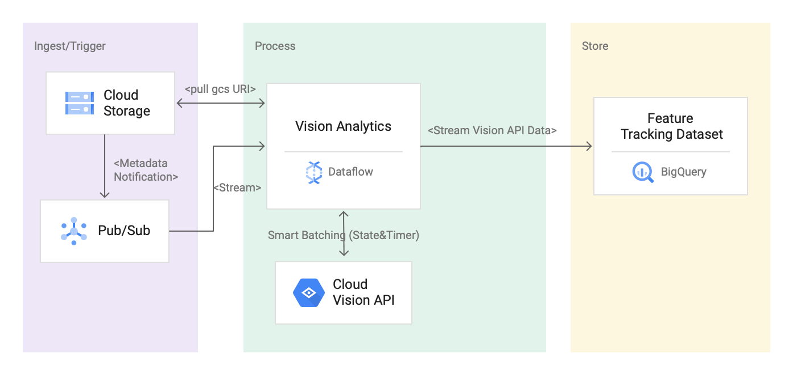

# Solution Details


# Getting Started

### Build
#### Gradle Build

```
gradle spotlessApply -DmainClass=com.google.solutions.ml.api.vision.VisionAnalyticsPipeline
gradle build -DmainClass=com.google.solutions.ml.api.vision.VisionAnalyticsPipeline
```
#### Create a input bucket

```
export PROJECT=$(gcloud config get-value project)
export REGION=[REGION]
export IMAGES_INPUT_BUCKET=${PROJECT}_IMAGE_ANALYSIS
gsutil mb -c standard -l ${REGION} gs://${IMAGES_INPUT_BUCKET}
```


#### Create a notification topic and subscriber 
```export GCS_NOTIFICATION_TOPIC="gcs-notification-topic"
gcloud pubsub topics create ${GCS_NOTIFICATION_TOPIC}
export GCS_NOTIFICATION_SUBSCRIPTION="gcs-notification-subscription"
gcloud pubsub subscriptions create ${GCS_NOTIFICATION_SUBSCRIPTION} --topic=${GCS_NOTIFICATION_TOPIC}
```

#### Create a PubSub notification from GCS bucket

```
gsutil notification create -t ${GCS_NOTIFICATION_TOPIC} -f json  gs://${IMAGES_INPUT_BUCKET}
```

#### Create a BigQuery Dataset

```
export BIGQUERY_DATASET="video_analytics"
bq mk -d --location=US ${BIGQUERY_DATASET}
```


### Flex Template
####  Create the docker image for Flex template:

```
gcloud auth configure-docker
gradle jib --image=gcr.io/${PROJECT}/dataflow-vision-analytics:latest

```

#### Create a bucket to store flex template config: 

```
export DATAFLOW_TEMPLATE_BUCKET=${PROJECT}_dataflow_template_config
gsutil mb -c standard -l ${REGION} gs://${DATAFLOW_TEMPLATE_BUCKET}

```

#### Upload the template JSON config file to the bucket:

```
cat << EOF | gsutil cp - gs://${DATAFLOW_TEMPLATE_BUCKET}/dynamic_template_vision_analytics.json
{
  "image": "gcr.io/${PROJECT}/dataflow-vision-analytics:latest",
  "sdk_info": {"language": "JAVA"}
}
EOF
```
 
# Test and Validate
As an example, we will perform two tests:

* Test # 1: Process a small set of files for a number of  feature types to validate if the tables are created with the correct schema automatically.
* Test # 2: Process >30k images from flickr dataset for Label and Landmark detection. 

## Test # 1

### Automated  BigQuery Table Creation with Vision API Feature Types
You can trigger the pipeline either by the flex template or by simply using the gradle run command. 

####  Trigger By Flex Template:

```
gcloud beta dataflow flex-template run "vision-analytics-test-1" \
--project=${PROJECT}\
--region=${REGION} \
--template-file-gcs-location=gs://${DATAFLOW_TEMPLATE_BUCKET}/dynamic_template_vision_analytics.json \
--parameters=<<'EOF'
^~^autoscalingAlgorithm="THROUGHPUT_BASED_"~numWorkers=5~maxNumWorkers=5~workerMachineType=n1-highmem-4
  ~subscriberId=projects/${PROJECT}/subscriptions/${GCS_NOTIFICATION_SUBSCRIPTION}~visionApiProjectId=${PROJECT}
  ~features=IMAGE_PROPERTIES,LABEL_DETECTION,LANDMARK_DETECTION,LOGO_DETECTION,CROP_HINTS,FACE_DETECTION
  ~datasetName=${BIGQUERY_DATASET}
  ~streaming=true
EOF
```

####  (Optional) Trigger By Gradle Run 

```
gradle run -DmainClass=com.google.solutions.ml.api.vision.VisionAnalyticsPipeline -Pargs="--streaming --project=next-demo-2020 --runner=DataflowRunner --subscriberId=projects/${PROJECT}/subscriptions/${GCS_NOTIFICATION_SUBSCRIPTION}
--visionApiProjectId=${PROJECT}/ --enableStreamingEngine  --features=IMAGE_PROPERTIES,LABEL_DETECTION,LANDMARK_DETECTION,LOGO_DETECTION,CROP_HINTS,FACE_DETECTION "
```

#### Validate pipeline is successfully started: 

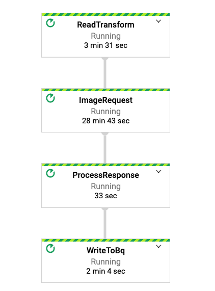

#### Copy some test files to the input bucket:

```
gsutil  cp gs://df-vision-ai-test-data/bali.jpeg gs://${IMAGES_INPUT_BUCKET}
gsutil  cp gs://df-vision-ai-test-data/faces.jpeg gs://${IMAGES_INPUT_BUCKET}
gsutil  cp gs://df-vision-ai-test-data/bubble.jpeg gs://${IMAGES_INPUT_BUCKET}
gsutil  cp gs://df-vision-ai-test-data/setagaya.jpeg gs://${IMAGES_INPUT_BUCKET}
gsutil  cp gs://df-vision-ai-test-data/st_basils.jpeg gs://${IMAGES_INPUT_BUCKET}
gsutil  cp gs://df-vision-ai-test-data/goggle_logo_logo.jpg gs://${IMAGES_INPUT_BUCKET}
```

#### Validate Custom Counter in Dataflow
 
 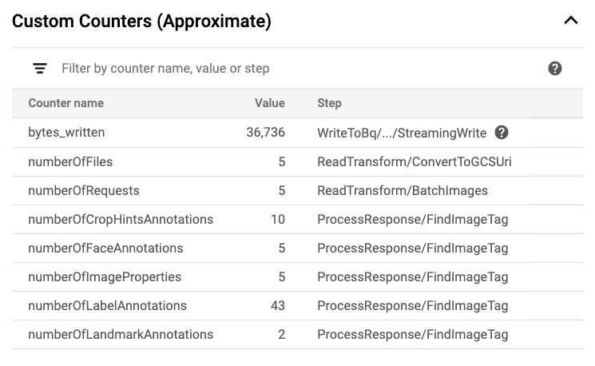
 
#### Query information schema table to validate tables
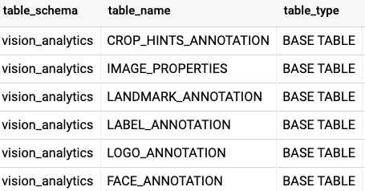

#### Validate Table Schema

```
bq show --schema --format=prettyjson ${BIGQUERY_DATASET}.LANDMARK_ANNOTATION
```

Screen shot to show the schema: 

```
[
   {
      "name":"gcsUri",
      "type":"STRING"
   },
   {
      "name":"feature_type",
      "type":"STRING"
   },
   {
      "name":"transaction_timestamp",
      "type":"STRING"
   },
   {
      "name":"mid",
      "type":"STRING"
   },
   {
      "name":"description",
      "type":"STRING"
   },
   {
      "name":"score",
      "type":"FLOAT"
   },
   {
      "fields":[
         {
            "fields":[
               {
                  "name":"x",
                  "type":"INTEGER"
               },
               {
                  "name":"y",
                  "type":"INTEGER"
               }
            ],
            "mode":"REPEATED",
            "name":"vertices",
            "type":"RECORD"
         }
      ],
      "name":"boundingPoly",
      "type":"RECORD"
   },
   {
      "fields":[
         {
            "fields":[
               {
                  "name":"latitude",
                  "type":"FLOAT"
               },
               {
                  "name":"longitude",
                  "type":"FLOAT"
               }
            ],
            "name":"latLon",
            "type":"RECORD"
         }
      ],
      "mode":"REPEATED",
      "name":"locations",
      "type":"RECORD"
   }
]
```

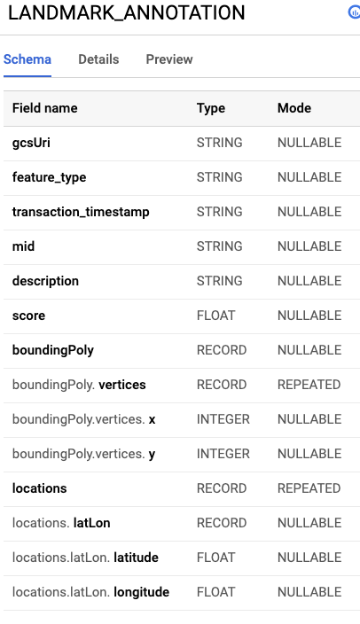
## Test # 2
### Fickr30kImage dataset for analysis 
In this test, we will detect label and landmark from  [public flickr 30k image dataset](https://www.kaggle.com/hsankesara/flickr-image-dataset). 

#### Trigger the pipeline with additional parameters for optimal performance

```
gcloud beta dataflow flex-template run "vision-analytics-test-1" --project=next-demo-2020 --region=us-central1 --template-file-gcs-location=gs://df-template-vision/dynamic_template_vison_analytics.json --parameters=^~^autoscalingAlgorithm=THROUGHPUT_BASED~numWorkers=5~maxNumWorkers=5~workerMachineType=n1-highmem-4~subscriberId=projects/next-demo-2020/subscriptions/vision-events-sub~visionApiProjectId=next-demo-2020~features=LABEL_DETECTION,LANDMARK_DETECTION~datasetName=vision_analytics~streaming=true~batchSize=16~windowInterval=5~keyRange=1024
```
 
### Copy dataset to input bucket
 
 ```
 gsutil -m  cp gs://df-vision-ai-test-data/*  gs://${IMAGES_INPUT_BUCKET}
When fully completed in a minute or so, you will see something like below:
\ [31.9k/31.9k files][  4.2 GiB/  4.2 GiB] 100% Done  27.6 MiB/s ETA 00:00:00   
Operation completed over 31.9k objects/4.2 GiB. 
 ```
 
 Pipeline uses Vision API batch annotation processing. You should see all the files are processed in less than 30 minutes and customer counter it's displayed like below:  Please note how numberOfFiles (31935) matches with out total number of images but numberOfRequests (2k) are less than the number of files as we are batching 16 files /request. Also, it looks like we have found 260k+ labels and 915 landmarks. 

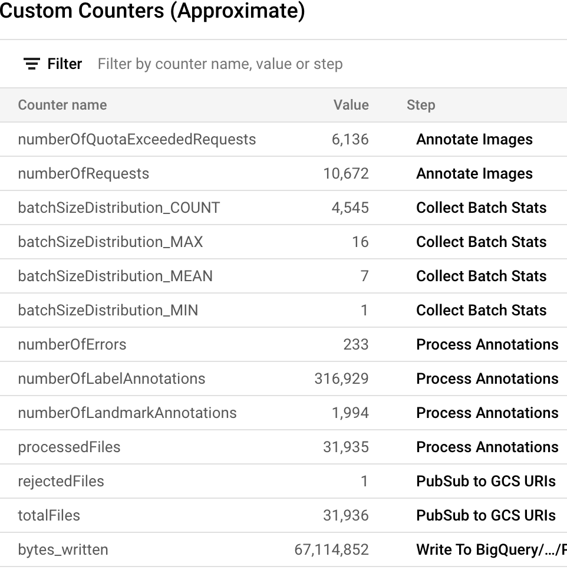


 
# Analysis In BigQuery
We have processed 31935 images for label and landmark annotation under 30 minutes with the default quota. Let's see if we can gather following stats from these files: 
#### Top label by file 

```
SELECT gcsUri, any_value(description), max(score) as score 
FROM `<dataset_name>.LABEL_ANNOTATION`
GROUP BY  gcsUri
ORDER BY gcsUri desc
```

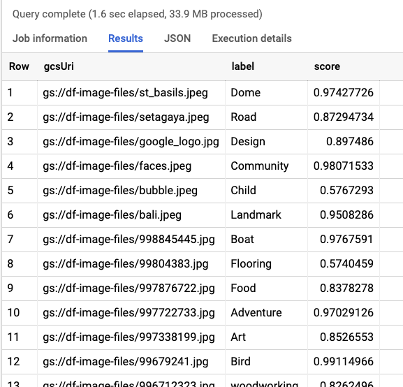


####  Top 10 labels 

 ```
 SELECT description, count(description) as found, max(score) as score
FROM `<dataset_name>.LABEL_ANNOTATION`
GROUP BY description
ORDER BY found desc limit 10
 ```

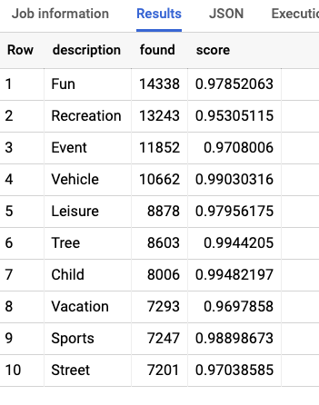

####  Top 10 popular landmark

```
SELECT description, count(description) as count, max(score) as score
FROM `<dataset_name>.LANDMARK_ANNOTATION` 
WHERE length(description)>0
GROUP BY description 
ORDER BY count desc limit 10
```

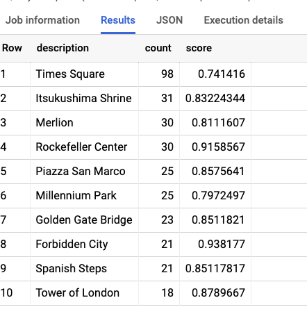

#### Images with falls

```
SELECT  gcsUri, description, max(score) as score
FROM `<dataset_name>.LANDMARK_ANNOTATION` 
WHERE lower(description) like '%fall%'
GROUP BY gcsUri, description
ORDER BY score desc
```

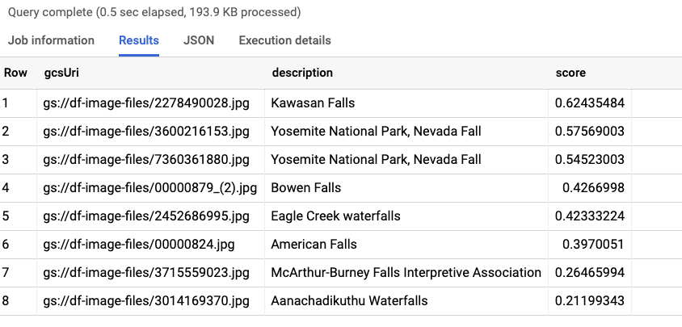
#### Popular Parks
```
SELECT  description, count(description) as count
FROM `<dataset_name>.LANDMARK_ANNOTATION` 
WHERE  lower(description) like '%park%'
GROUP BY description
ORDER BY count desc limit 10
```


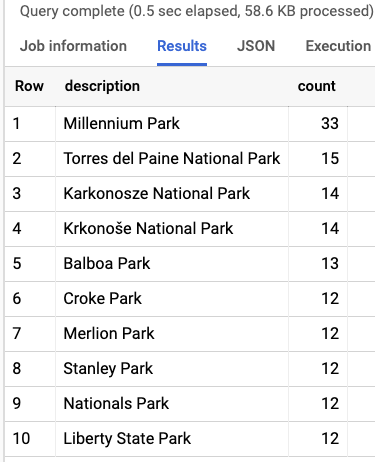
