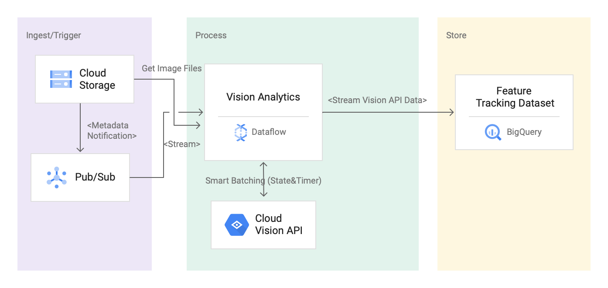
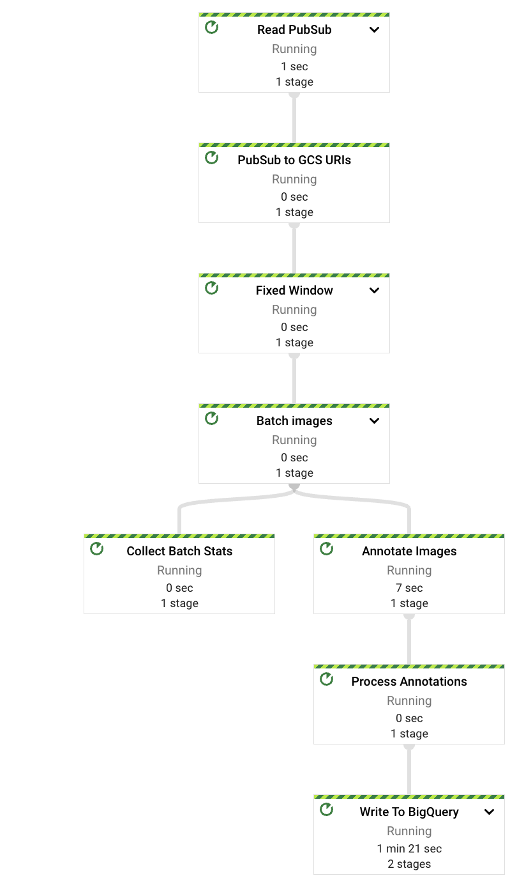
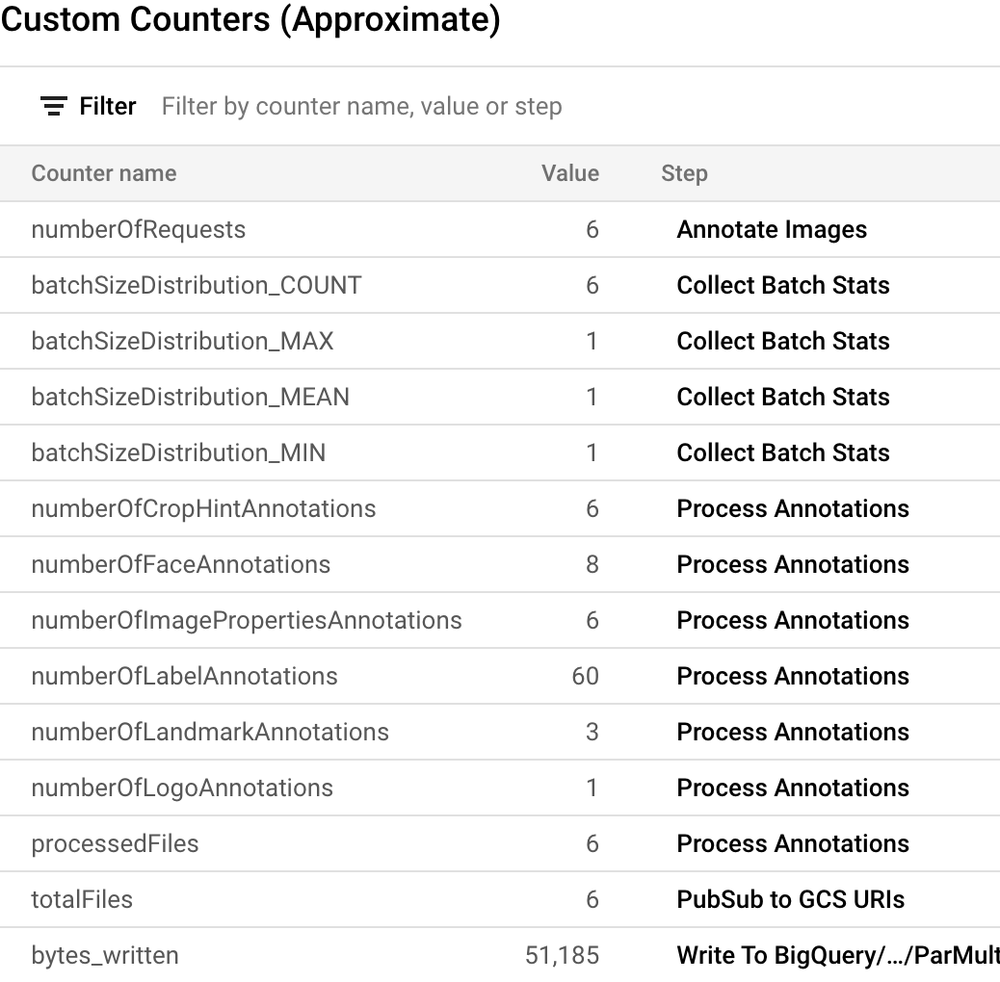

# Vision Analytics Solution Using Dataflow & Vision AI 

<!-- TODO: remove comments once the guide is re-published
**IMPORTANT**: The content of this README file is now updated and published here: [Building a streaming video analytics pipeline](https://cloud.google.com/solutions/building-a-streaming-video-analytics-pipeline).
-->

This repo contains a reference implementation to derive insights from large scale image files stored in a GCS bucket.  
The goal is to provide an easy-to-use end to end automated solution by using Dataflow and Vision API.  
Response from  Vision API  is stored in BigQuery tables based on feature type and can be used as additional features 
to create machine learning model by using BigQuery ML or Auto ML.
	
# Reference Architecture



# Solution Details
Visual inspection solution is designed to address major pain points for customers looking to improve quality control process,
monitor workers safety, or do other kinds of advanced image analysis while reducing cost. 
This is a generic solution to automate inspection process by using Vision AI and Dataflow.  Solution works as below:

1. Images are uploaded in a GCS bucket from source systems. 
2. An automated  notification is sent out to PubSub topic for processing. 
3. Dataflow pipeline processes the image file based on the configurations provided:
	a) Features: List of Vision API features to use for processing
	b) BatchSize: Maximum 16 images /call. This helps to process large scale image files in a performance optimal manner. 
	c) Parallel Processing: Control the number of parallel calls to API to leverage number of quotas (concurrent api calls) for Vision API.
	d) BigQuery Dataset: Based on the response tables will be created automatically in this dataset. 
4. Dataflow calls the Vision API and store the response in BigQuery for each feature type.

# Getting Started

### Prepare infrastructure
We recommend that you create a new Google Cloud project to try this solution. It will simplify the cleanup process.

#### Create an input bucket

```
export PROJECT=$(gcloud config get-value project)
export REGION=<us-central1 or your preferred region>
export IMAGES_INPUT_BUCKET=${PROJECT}-image-analysis
gsutil mb -c standard -l ${REGION} gs://${IMAGES_INPUT_BUCKET}
```


#### Create a notification topic and subscriber 
```
export GCS_NOTIFICATION_TOPIC="gcs-notification-topic"
gcloud pubsub topics create ${GCS_NOTIFICATION_TOPIC}
export GCS_NOTIFICATION_SUBSCRIPTION="gcs-notification-subscription"
gcloud pubsub subscriptions create ${GCS_NOTIFICATION_SUBSCRIPTION} --topic=${GCS_NOTIFICATION_TOPIC}
```

#### Create a PubSub notification from GCS bucket

```
gsutil notification create -t ${GCS_NOTIFICATION_TOPIC} -f json  gs://${IMAGES_INPUT_BUCKET}
```

#### Create a BigQuery Dataset

```
export BIGQUERY_DATASET="vision_analytics"
bq mk -d --location=${REGION} ${BIGQUERY_DATASET}
```

#### Enable Vision API
```shell
gcloud services enable vision.googleapis.com
```
 
# Test and Validate
As an example, we will perform two tests:

* Test # 1: Process a small set of files for a number of  feature types to validate if the tables are created with the correct schema automatically.
* Test # 2: Process >30k images from flickr dataset for Label and Landmark detection. 

## Test 1

### Automated  BigQuery Table Creation with Vision API Feature Types
####  Run the pipeline 

```
./gradlew run --args=" \
--jobName=test-vision-analytics \
--streaming \
--runner=DataflowRunner \
--project=${PROJECT} \
--datasetName=${BIGQUERY_DATASET} \
--subscriberId=projects/${PROJECT}/subscriptions/${GCS_NOTIFICATION_SUBSCRIPTION} \
--visionApiProjectId=${PROJECT} \
--features=IMAGE_PROPERTIES,LABEL_DETECTION,LANDMARK_DETECTION,LOGO_DETECTION,CROP_HINTS,FACE_DETECTION"
```

#### Validate pipeline is successfully started: 



#### Copy some test files to the input bucket:

```
gsutil cp data-sample/* gs://${IMAGES_INPUT_BUCKET}
```

#### Validate Custom Counter in Dataflow
 
 
 
#### Query information schema table to validate tables

```
bq query --nouse_legacy_sql "SELECT table_name FROM ${BIGQUERY_DATASET}.INFORMATION_SCHEMA.TABLES ODRER BY table_name;"

```
You will see output like this:
```shell
+----------------------+
|      table_name      |
+----------------------+
| crop_hint_annotation |
| face_annotation      |
| image_properties     |
| label_annotation     |
| landmark_annotation  |
| logo_annotation      |
+----------------------+
```

#### Validate Table Schema

```shell
bq show --schema --format=prettyjson ${BIGQUERY_DATASET}.landmark_annotation
```

The output should look like: 

```json
[
   {
      "name":"gcs_uri",
      "type":"STRING"
   },
   {
      "name":"feature_type",
      "type":"STRING"
   },
   {
      "name":"transaction_timestamp",
      "type":"STRING"
   },
   {
      "name":"mid",
      "type":"STRING"
   },
   {
      "name":"description",
      "type":"STRING"
   },
   {
      "name":"score",
      "type":"FLOAT"
   },
   {
      "fields":[
         {
            "fields":[
               {
                  "name":"x",
                  "type":"INTEGER"
               },
               {
                  "name":"y",
                  "type":"INTEGER"
               }
            ],
            "mode":"REPEATED",
            "name":"vertices",
            "type":"RECORD"
         }
      ],
      "name":"boundingPoly",
      "type":"RECORD"
   },
   {
      "fields":[
         {
            "fields":[
               {
                  "name":"latitude",
                  "type":"FLOAT"
               },
               {
                  "name":"longitude",
                  "type":"FLOAT"
               }
            ],
            "name":"latLon",
            "type":"RECORD"
         }
      ],
      "mode":"REPEATED",
      "name":"locations",
      "type":"RECORD"
   }
]
```

#### Validate data

```shell
 bq query --nouse_legacy_sql "SELECT SPLIT(gcs_uri, '/')[OFFSET(3)] file_name, description, score, locations FROM ${BIGQUERY_DATASET}.landmark_annotation"

```
You will see that the Vision Analytics API recognized multiple landmarks in the `eiffel_tower.jpg` image:
```text
+------------------+-------------------+------------+---------------------------------+
|    file_name     |    description    |   score    |            locations            |
+------------------+-------------------+------------+---------------------------------+
| eiffel_tower.jpg | Champ De Mars     |   0.680893 | ["POINT(2.2986304 48.8556475)"] |
| eiffel_tower.jpg | Eiffel Tower      | 0.72533846 | ["POINT(2.2944813 48.8583701)"] |
| eiffel_tower.jpg | Trocadéro Gardens |  0.6957032 | ["POINT(2.2892823 48.8615963)"] |
+------------------+-------------------+------------+---------------------------------+
```

### Stop the pipeline

```shell
gcloud dataflow jobs cancel $(gcloud dataflow jobs list --region $REGION --filter="NAME:test-vision-analytics AND STATE:Running" --format="get(JOB_ID)")
```

## Test 2
### Flickr30kImage dataset for analysis 
In this test, we will detect labels and landmarks from  [public flickr 30k image dataset](https://www.kaggle.com/hsankesara/flickr-image-dataset). 

#### Trigger the pipeline with additional parameters for optimal performance

```shell
./gradlew run --args=" \
--runner=DataflowRunner \
--jobName=vision-analytics-flickr \
--streaming \
--autoscalingAlgorithm=THROUGHPUT_BASED \
--numWorkers=2 \
--maxNumWorkers=5 \
--project=${PROJECT} \
--region=${REGION} \
--subscriberId=projects/${PROJECT}/subscriptions/${GCS_NOTIFICATION_SUBSCRIPTION} \
--visionApiProjectId=${PROJECT} \
--features=LABEL_DETECTION,LANDMARK_DETECTION \
--datasetName=${BIGQUERY_DATASET} \
--batchSize=16 \
--windowInterval=5 \
--keyRange=1024"
```
 
### Copy dataset to input bucket
 
```shell
gsutil -m  cp gs://df-vision-ai-test-data/*  gs://${IMAGES_INPUT_BUCKET}
```
When fully completed in a minute or so, you will see something like below:
```text
\ [31.9k/31.9k files][  4.2 GiB/  4.2 GiB] 100% Done  27.6 MiB/s ETA 00:00:00   
Operation completed over 31.9k objects/4.2 GiB. 
```

Pipeline uses Vision API batch annotation processing. You should see all the files are processed in less than 30 minutes and customer counter it's displayed like below: 
It looks like we have found over 300,000 labels and almost 2,000 landmarks.

### Stop the pipeline
Now that the processing is complete let's stop the pipeline:

```shell
gcloud dataflow jobs list --region $REGION --filter="NAME:vision-analytics-flickr AND STATE:Running" --format="get(JOB_ID)"
```


 
# Analysis In BigQuery
We have processed over 30,000 images for label and landmark annotation under 30 minutes with the default quota. 
Let's see if we can gather following stats from these files. You can run these queries in the BigQuery SQL workspace.

Be aware that the numbers that you will see can vary from the query results in this demo. Vision API constantly improves 
the accuracy of analysis; it can produce richer results analyzing the same image after you initially test the solution.


#### Top 20 labels in the dataset
```
SELECT  description, count(*) as count 
	FROM vision_analytics.label_annotation
	GROUP BY  description
	ORDER BY count desc
	LIMIT 20
```

```text
+------------------+-------+
|   description    | count |
+------------------+-------+
| Leisure          |  7663 |
| Plant            |  6858 |
| Event            |  6044 |
| Sky              |  6016 |
| Tree             |  5610 |
| Fun              |  5008 |
| Grass            |  4279 |
| Recreation       |  4176 |
| Shorts           |  3765 |
| Happy            |  3494 |
| Wheel            |  3372 |
| Tire             |  3371 |
| Water            |  3344 |
| Vehicle          |  3068 |
| People in nature |  2962 |
| Gesture          |  2909 |
| Sports equipment |  2861 |
| Building         |  2824 |
| T-shirt          |  2728 |
| Wood             |  2606 |
+------------------+-------+
```


####  Which other labels are present on an image with a particular label, ranked by frequency

```sql
DECLARE label STRING DEFAULT 'Plucked string instruments';
    
WITH other_labels AS (
	SELECT
		description, COUNT(*) count
		FROM vision_analytics.label_annotation 
		WHERE gcs_uri IN (
			SELECT gcs_uri FROM vision_analytics.label_annotation WHERE description = label )
			AND description != label
	GROUP BY description LIMIT 20)

SELECT description, ROW_NUMBER() OVER (ORDER BY count DESC) FROM other_labels;
```
For the label we chose, "Plucked string instruments", we saw: 

```text
+------------------------------+-----+
|         description          | f0_ |
+------------------------------+-----+
| String instrument            |   1 |
| Musical instrument           |   2 |
| Musician                     |   3 |
| Guitar                       |   4 |
| Guitar accessory             |   5 |
| String instrument accessory  |   6 |
| Music                        |   7 |
| Musical instrument accessory |   8 |
| Guitarist                    |   9 |
| Folk instrument              |  10 |
| Violin family                |  11 |
| Entertainment                |  12 |
| Artist                       |  13 |
| Wood                         |  14 |
| Leisure                      |  15 |
| Classical music              |  16 |
| Electronic instrument        |  17 |
| Purple                       |  18 |
| Asphalt                      |  19 |
| Stage                        |  20 |
+------------------------------+-----+
```

####  Most frequently detected landmarks

```sql
SELECT
  description,
  COUNT(description) AS count
FROM
  vision_analytics.landmark_annotation
GROUP BY description ORDER BY count DESC LIMIT 10
```

```text
+--------------------+-------+
|    description     | count |
+--------------------+-------+
| Times Square       |    51 |
| Rockefeller Center |    20 |
| St. Mark's Square  |    15 |
| Millennium Park    |    14 |
| Bryant Park        |    14 |
| Central Park       |    12 |
| Tuileries Garden   |    11 |
| National Mall      |    11 |
| Ponte Vecchio      |    11 |
| Starbucks          |    10 |
+--------------------+-------+
```

#### Top ten images with which most likely contain waterfall landmarks

```sql
SELECT
  SPLIT(gcs_uri, '/')[OFFSET(3)] file_name, description, score
FROM
  vision_analytics.landmark_annotation
WHERE
  LOWER(description) LIKE '%fall%'
ORDER BY score DESC LIMIT 10
```

```text
+----------------+----------------------------+------------+
|   file_name    |        description         |   score    |
+----------------+----------------------------+------------+
| 895502702.jpg  | Waterfall Carispaccha      | 0.61715007 |
| 00000824.jpg   | Fallsview Tourist Area     |  0.4806697 |
| 00000824.jpg   | Niagara Falls              | 0.47041866 |
| 3639105305.jpg | Sahalie Falls Viewpoint    | 0.44370842 |
| 3672309620.jpg | Gullfoss Falls             |  0.4179154 |
| 65845718.jpg   | Museu Faller De València   | 0.36596915 |
| 3484649669.jpg | Kodiveri Waterfalls        | 0.35093677 |
| 539801139.jpg  | Mallela Thirtham Waterfall | 0.29361233 |
| 3639105305.jpg | Sahalie Falls              | 0.27951124 |
| 3050114829.jpg | Kawasan Falls              | 0.27129364 |
+----------------+----------------------------+------------+
```

#### Refined search for waterfalls
Not all the images in the previous search actually show waterfalls. Let's refine our search and see if these images also 
contain the "Waterfall" label:

```sql
SELECT SPLIT(gcs_uri, '/')[OFFSET(3)] file_name, description, score
FROM
  vision_analytics.landmark_annotation landmarks
WHERE
  LOWER(description) LIKE '%fall%'
  AND EXISTS (SELECT * FROM
    vision_analytics.label_annotation labels
  WHERE
    labels.gcs_uri = landmarks.gcs_uri
    AND description = 'Waterfall')
ORDER BY score DESC LIMIT 5
```

```text
+------------------+-------------------------+------------+
|    file_name     |       description       |   score    |
+------------------+-------------------------+------------+
| 00000824.jpg     | Fallsview Tourist Area  |  0.4806697 |
| 00000824.jpg     | Niagara Falls           | 0.47041866 |
| 3639105305.jpg   | Sahalie Falls Viewpoint | 0.44370842 |
| 3639105305.jpg   | Sahalie Falls           | 0.27951124 |
| 00000879_(2).jpg | Bowen Falls             | 0.15902041 |
+------------------+-------------------------+------------+
```

# Clean up
If you created a separate project to try this solution you can just delete the project from the Google Cloud Console. 
You don't need to perform individual steps listed below if you do that.

## Delete the BigQuery dataset

```shell
bq rm -r -d $BIGQUERY_DATASET 
```
## Delete the Pub/Sub topic
```shell
gcloud pubsub topics delete ${GCS_NOTIFICATION_TOPIC}
```
The subscription associated with the topic will be automatically deleted.

## Delete the Cloud Storage bucket
Due to the large number of files to delete the most efficient way to do it is via Google Cloud Console. Please see
[these instructions](https://cloud.google.com/storage/docs/deleting-buckets#delete-bucket-console) on how to do it.

To delete from a command line:
```shell
gsutil -m  rm -r  gs://${IMAGES_INPUT_BUCKET} 
```
