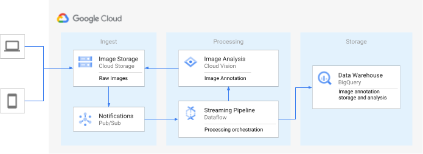
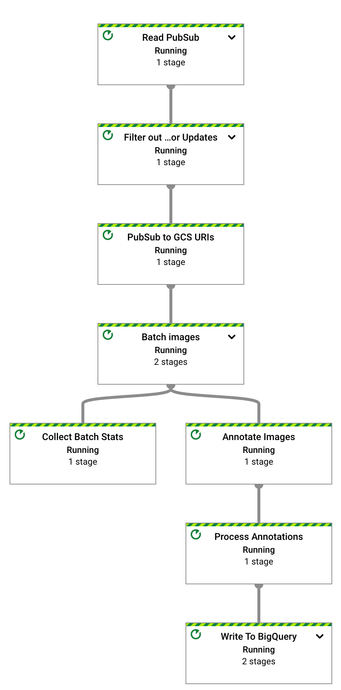

# Vision Analytics Solution Using Dataflow & Vision AI

This repo contains a reference implementation to derive insights from image files stored
in a Google Storage bucket. The goal is to provide an easy-to-use automated solution by using Dataflow and Vision
API.

Image annotations produced by Vision API are stored in BigQuery tables based on annotation type and can be used as
additional features to create machine learning models by using BigQuery ML or Auto ML.

# Reference Architecture



The visual analytics solution is designed to address major pain points for customers looking to improve the
quality control process, monitor workers safety, or do other kinds of advanced image analysis while reducing cost.
This is a generic solution to automate the inspection process using Vision AI and Dataflow. The solution
works as below:

1. Images are uploaded in a Cloud Storage bucket from source systems.
2. An automated notification is sent to a Pub/Sub topic every time a new file is created.
3. Dataflow pipeline processes the image file based on the following parameters:
   a) Features: List of Vision API features to use for processing.
   b) Batch size: Up to 16 images per call. Batching helps to process a large number of image files in the most efficient manner.
   c) Parallel Processing: Control the maximum number of parallel calls to API to avoid exceeding
   Vision API quotas.
   d) BigQuery Dataset: Based on the requested features, tables will be created automatically in this dataset.
4. Dataflow calls Vision API with the list of files to process.
5. Vision API analyzes the images and returns the annotations to Dataflow.
6. Dataflow stores responses to BigQuery.

# Getting Started

### Prepare infrastructure

We recommend creating a new Google Cloud project to try this solution. It will simplify the
cleanup process.

#### Create an input bucket

```
export PROJECT=$(gcloud config get-value project)
export REGION=<us-central1 or your preferred region>
export IMAGE_BUCKET=${PROJECT}-image-analysis
gcloud storage buckets create gs://${IMAGE_BUCKET} --uniform-bucket-level-access --location ${REGION}
```

#### Create a notification topic and subscriber

```
export GCS_NOTIFICATION_TOPIC="gcs-notification-topic"
gcloud pubsub topics create ${GCS_NOTIFICATION_TOPIC}
export GCS_NOTIFICATION_SUBSCRIPTION="gcs-notification-subscription"
gcloud pubsub subscriptions create ${GCS_NOTIFICATION_SUBSCRIPTION} --topic=${GCS_NOTIFICATION_TOPIC}
```

#### Create a PubSub notification from GCS bucket

```
gcloud storage buckets notifications create \
 --event-types=OBJECT_FINALIZE \
 --topic=${GCS_NOTIFICATION_TOPIC}  --skip-topic-setup \
 --payload-format json  gs://${IMAGE_BUCKET}
```

#### Create a BigQuery Dataset

```
export BIGQUERY_DATASET="vision_analytics"
bq mk -d --location=${REGION} ${BIGQUERY_DATASET}
```

#### Enable Dataflow and Vision APIs

```shell
gcloud services enable dataflow.googleapis.com vision.googleapis.com 
```

# Test and Validate

As an example, we will perform two tests:

* Test # 1: Process a small set of files for a number of feature types to validate if the tables are
  created with the correct schema automatically.
* Test # 2: Process about 30,000 images from a public Flickr dataset for Label and Landmark detection.

## Test 1

### Automated  BigQuery Table Creation with Vision API Feature Types

#### Run the pipeline

```
./gradlew run --args=" \
--jobName=test-vision-analytics \
--streaming \
--runner=DataflowRunner \
--enableStreamingEngine \
--diskSizeGb=30 \
--project=${PROJECT} \
--datasetName=${BIGQUERY_DATASET} \
--subscriberId=projects/${PROJECT}/subscriptions/${GCS_NOTIFICATION_SUBSCRIPTION} \
--visionApiProjectId=${PROJECT} \
--features=IMAGE_PROPERTIES,LABEL_DETECTION,LANDMARK_DETECTION,LOGO_DETECTION,CROP_HINTS,FACE_DETECTION"
```

#### Validate pipeline is successfully started:



#### Copy some test files to the input bucket:

```
gcloud storage cp data-sample/* gs://${IMAGE_BUCKET}
```

#### Validate Custom Counters in Dataflow
Shortly after the files are sent, the Dataflow Job's Customer Counters panel will show:


Hint: type "numberOf" in the Filter field to only display the counters shown above.

#### Query the information schema view to validate tables

```
bq query --nouse_legacy_sql "SELECT table_name FROM ${BIGQUERY_DATASET}.INFORMATION_SCHEMA.TABLES ORDER BY table_name;"

```

You will see output like this:

```shell
+----------------------+
|      table_name      |
+----------------------+
| crop_hint_annotation |
| face_annotation      |
| image_properties     |
| label_annotation     |
| landmark_annotation  |
| logo_annotation      |
+----------------------+
```

#### Validate Table Schema

```shell
bq show --schema --format=prettyjson ${BIGQUERY_DATASET}.landmark_annotation
```

The output should look like:

```json
[
  {
    "name": "gcs_uri",
    "type": "STRING"
  },
  {
    "name": "feature_type",
    "type": "STRING"
  },
  {
    "name": "transaction_timestamp",
    "type": "STRING"
  },
  {
    "name": "mid",
    "type": "STRING"
  },
  {
    "name": "description",
    "type": "STRING"
  },
  {
    "name": "score",
    "type": "FLOAT"
  },
  {
    "fields": [
      {
        "fields": [
          {
            "name": "x",
            "type": "INTEGER"
          },
          {
            "name": "y",
            "type": "INTEGER"
          }
        ],
        "mode": "REPEATED",
        "name": "vertices",
        "type": "RECORD"
      }
    ],
    "name": "boundingPoly",
    "type": "RECORD"
  },
  {
    "fields": [
      {
        "fields": [
          {
            "name": "latitude",
            "type": "FLOAT"
          },
          {
            "name": "longitude",
            "type": "FLOAT"
          }
        ],
        "name": "latLon",
        "type": "RECORD"
      }
    ],
    "mode": "REPEATED",
    "name": "locations",
    "type": "RECORD"
  }
]
```

_Notice_: this schema reflects the attributes available in Vision API of a specific version. Google
frequently updates the API to include new attributes and improve attribute detection quality.

#### Validate data

```shell
 bq query --nouse_legacy_sql "SELECT SPLIT(gcs_uri, '/')[OFFSET(3)] file_name, description, score, locations FROM ${BIGQUERY_DATASET}.landmark_annotation ORDER BY score DESC"

```

You will see that the Vision Analytics API recognized multiple landmarks in the `eiffel_tower.jpg`
image:

```text
+------------------+-------------------+------------+---------------------------------+
|    file_name     |    description    |   score    |            locations            |
+------------------+-------------------+------------+---------------------------------+
| eiffel_tower.jpg | Eiffel Tower      |  0.7251996 | ["POINT(2.2944813 48.8583701)"] |
| eiffel_tower.jpg | Trocadéro Gardens | 0.69601923 | ["POINT(2.2892823 48.8615963)"] |
| eiffel_tower.jpg | Champ De Mars     |  0.6800974 | ["POINT(2.2986304 48.8556475)"] |
+------------------+-------------------+------------+---------------------------------+
```

### Stop the pipeline

```shell
gcloud dataflow jobs cancel --region ${REGION} $(gcloud dataflow jobs list --region ${REGION} --filter="NAME:test-vision-analytics AND STATE:Running" --format="get(JOB_ID)")
```

## Test 2

### Analyzing Flickr30kImage dataset

In this test, we will detect labels and landmarks in images
from [the public Flickr30k image dataset](https://www.kaggle.com/hsankesara/flickr-image-dataset)
hosted on Kaggle.

#### Start the pipeline with additional parameters for optimal performance

```shell
./gradlew run --args=" \
--runner=DataflowRunner \
--jobName=vision-analytics-flickr \
--streaming \
--enableStreamingEngine \
--diskSizeGb=30 \
--autoscalingAlgorithm=THROUGHPUT_BASED \
--maxNumWorkers=5 \
--project=${PROJECT} \
--region=${REGION} \
--subscriberId=projects/${PROJECT}/subscriptions/${GCS_NOTIFICATION_SUBSCRIPTION} \
--visionApiProjectId=${PROJECT} \
--features=LABEL_DETECTION,LANDMARK_DETECTION \
--datasetName=${BIGQUERY_DATASET} \
--batchSize=16 \
--keyRange=5"
```

### Simulate the images being uploaded to the Storage Bucket

We will copy the dataset to the storage bucket. As we are copying the data, the pipeline will start
processing the files.

#### Generate Kaggle authentication token

Follow the instructions in [Kaggle documentation](https://www.kaggle.com/docs/api) to create a free
Kaggle account and generate a new authentication token. This token will be saved on your computer,
typically in the Downloads folder. You will need to copy its contents later to create the
same file on a temporary VM.

#### Create a Cloud Compute VM and connect to it

Flickr30K is a large dataset (9GB) of images and the Cloud Shell's VM does not have a large enough
disk to copy this archive.

Create a VM with a big enough disk to store the archive. Also give the read/write scope for the
default compute service account to be able to write to the bucket.

```shell
ZONE=$(gcloud compute zones list --limit 1 --filter region=${REGION} --format='get(NAME)')

gcloud compute instances create image-producer --zone=${ZONE} \
 --image-family debian-12 --image-project  debian-cloud \
 --boot-disk-size 200GB \
 --scopes=https://www.googleapis.com/auth/devstorage.read_write

gcloud compute ssh image-producer --zone=${ZONE}
```

#### Install Kaggle CLI

```shell
/usr/lib/google-cloud-sdk/platform/bundledpythonunix/bin/pip install kaggle
```

#### Copy Kaggle's authentication token

Copy the contents of the authentication token downloaded to your computer and create the token file
with the same contents on the temporary VM.

```shell
mkdir ~/.kaggle
echo "<contents of the authentication token>" > ~/.kaggle/kaggle.json
```

#### Download Kaggle Dataset

```shell
~/.local/bin/kaggle datasets download -d hsankesara/flickr-image-dataset
```

#### Unzip the archive

```shell
sudo apt install unzip
unzip -q flickr-image-dataset.zip
```

It will take a several minutes to unzip the archive.

#### Copy the images to the destination bucket

```shell
export PROJECT=$(gcloud config get-value project)
export IMAGE_BUCKET=${PROJECT}-image-analysis
gcloud storage cp  flickr30k_images/flickr30k_images/*.jpg gs://${IMAGE_BUCKET}
```

When copying is fully completed (it will take several minutes), you will see output similar to the
line below:

```text
Operation completed over 31.8k objects/4.1 GiB. 
```

#### Observe the processing progress

During the file copy process, let's look at the Dataflow console. Navigate to the Dataflow
Jobs page and select the "vision-analytics-flickr" pipeline. You should be able to see these
customer counters change periodically until all the files are processed:


In the example above, there were no rejected requests from Vision API. Take a look at the Vision
API [quota page](https://console.cloud.google.com/apis/api/vision.googleapis.com/quotas):


In our example, only roughly 50% of quota was utilized. Based on the percentage of the quota used
you can decide to increase the parallelism of the pipeline by increasing the value of the `keyRange`
parameter.

#### Delete the VM

Once all the files are copied, you can finish the ssh session on the temporary VM and delete it:

```shell
exit

gcloud compute instances delete image-producer --zone ${ZONE}
```

#### Stop the pipeline

Once you see that the number of processed files reached 31,783 (based on the Dataflow custom
counters) the pipeline finished all processing.
You can now stop it:

```shell
gcloud dataflow jobs list --region $REGION --filter="NAME:vision-analytics-flickr AND STATE:Running" --format="get(JOB_ID)"
```

# Analysis In BigQuery

We have processed over 30,000 images for label and landmark annotation under 30 minutes with the
default quota.
Let's see if we can gather the following stats from these files. You can run these queries in the
BigQuery SQL workspace.

Be aware that the numbers that you will see can vary from the query results in this demo. Vision API
constantly improves the accuracy of analysis; it can produce richer results analyzing the same image after you initially
test the solution.

#### Top 20 labels in the dataset

```
SELECT  description, count(*) as count 
	FROM vision_analytics.label_annotation
	GROUP BY  description
	ORDER BY count desc
	LIMIT 20
```

```text
+------------------+-------+
|   description    | count |
+------------------+-------+
| Leisure          |  7663 |
| Plant            |  6858 |
| Event            |  6044 |
| Sky              |  6016 |
| Tree             |  5610 |
| Fun              |  5008 |
| Grass            |  4279 |
| Recreation       |  4176 |
| Shorts           |  3765 |
| Happy            |  3494 |
| Wheel            |  3372 |
| Tire             |  3371 |
| Water            |  3344 |
| Vehicle          |  3068 |
| People in nature |  2962 |
| Gesture          |  2909 |
| Sports equipment |  2861 |
| Building         |  2824 |
| T-shirt          |  2728 |
| Wood             |  2606 |
+------------------+-------+
```

#### Which other labels are present on an image with a particular label, ranked by frequency

```sql
DECLARE label STRING DEFAULT 'Plucked string instruments';

WITH other_labels AS (
   SELECT description, COUNT(*) count
FROM vision_analytics.label_annotation
WHERE gcs_uri IN (
   SELECT gcs_uri FROM vision_analytics.label_annotation WHERE description = label )
  AND description != label
GROUP BY description)
SELECT description, count, RANK() OVER (ORDER BY count DESC) rank
FROM other_labels ORDER BY rank LIMIT 20;
```

For the label we chose, "Plucked string instruments", we saw:

```text
+------------------------------+-------+------+
|         description          | count | rank |
+------------------------------+-------+------+
| String instrument            |   397 |    1 |
| Musical instrument           |   236 |    2 |
| Musician                     |   207 |    3 |
| Guitar                       |   168 |    4 |
| Guitar accessory             |   135 |    5 |
| String instrument accessory  |    99 |    6 |
| Music                        |    88 |    7 |
| Musical instrument accessory |    72 |    8 |
| Guitarist                    |    72 |    8 |
| Microphone                   |    52 |   10 |
| Folk instrument              |    44 |   11 |
| Violin family                |    28 |   12 |
| Hat                          |    23 |   13 |
| Entertainment                |    22 |   14 |
| Band plays                   |    21 |   15 |
| Jeans                        |    17 |   16 |
| Plant                        |    16 |   17 |
| Public address system        |    16 |   17 |
| Artist                       |    16 |   17 |
| Leisure                      |    14 |   20 |
+------------------------------+-------+------+
```

#### Most frequently detected landmarks

```sql
SELECT description, COUNT(description) AS count
FROM
    vision_analytics.landmark_annotation
GROUP BY description
ORDER BY count DESC LIMIT 10
```

```text
+--------------------+-------+
|    description     | count |
+--------------------+-------+
| Times Square       |    55 |
| Rockefeller Center |    21 |
| St. Mark's Square  |    16 |
| Bryant Park        |    13 |
| Millennium Park    |    13 |
| Ponte Vecchio      |    13 |
| Tuileries Garden   |    13 |
| Central Park       |    12 |
| Starbucks          |    12 |
| National Mall      |    11 |
+--------------------+-------+
```

#### Top ten images with which most likely contain waterfall landmarks

```sql
SELECT SPLIT(gcs_uri, '/')[OFFSET(3)] file_name,
       description,
       score
FROM vision_analytics.landmark_annotation
WHERE LOWER(description) LIKE '%fall%'
ORDER BY score DESC LIMIT 10
```

```text
+----------------+----------------------------+------------+
|   file_name    |        description         |   score    |
+----------------+----------------------------+------------+
| 895502702.jpg  | Waterfall Carispaccha      |  0.6181358 |
| 3639105305.jpg | Sahalie Falls Viewpoint    | 0.44379658 |
| 3672309620.jpg | Gullfoss Falls             | 0.41680416 |
| 2452686995.jpg | Wahclella Falls            | 0.39005348 |
| 2452686995.jpg | Wahclella Falls            |  0.3792498 |
| 3484649669.jpg | Kodiveri Waterfalls        | 0.35024035 |
| 539801139.jpg  | Mallela Thirtham Waterfall | 0.29260656 |
| 3639105305.jpg | Sahalie Falls              |  0.2807213 |
| 3050114829.jpg | Kawasan Falls              | 0.27511594 |
| 4707103760.jpg | Niagara Falls              | 0.18691841 |
+----------------+----------------------------+------------+
```

# Clean up

If you created a separate project to try this solution you can just delete the project from the
Google Cloud Console.
You don't need to perform individual steps listed below if you do that.

## Delete the BigQuery dataset

```shell
bq rm -r -d $BIGQUERY_DATASET 
```

## Delete the Pub/Sub topic

```shell
gcloud pubsub topics delete ${GCS_NOTIFICATION_TOPIC}
```

The subscription associated with the topic will be automatically deleted.

## Delete the Cloud Storage bucket

Due to the large number of files to delete, the most efficient way to do it is via Google Cloud
Console. Please see
[these instructions](https://cloud.google.com/storage/docs/deleting-buckets#delete-bucket-console)
on how to do it.

To delete using a command line:

```shell
gcloud storage rm -r  gs://${IMAGE_BUCKET} 
```
